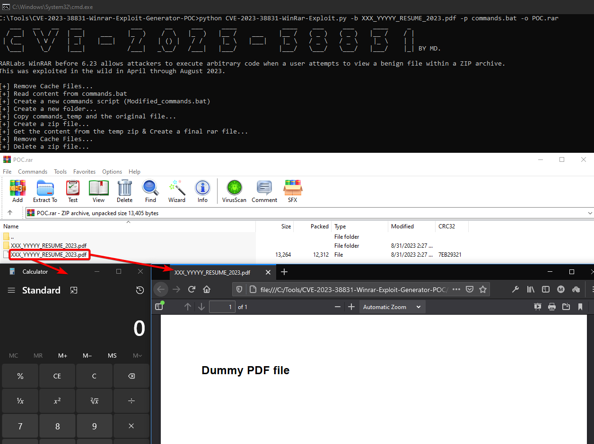

# CVE-2023-38831 Winrar Exploit Generator (POC)
This is a basic proof of concept for the CVE-2023-3883 exploit targeting WinRAR up to 6.22. Modified some existing internet-sourced POCs by introducing greater dynamism and incorporated additional try-except blocks within the code.

Description from CVE.mitre.org:
> RARLabs WinRAR before 6.23 allows attackers to execute arbitrary code when a user attempts to view a benign file within a ZIP archive. The issue occurs because a ZIP archive may include a benign file (such as an ordinary .JPG file) and also a folder that has the same name as the benign file, and the contents of the folder (which may include executable content) are processed during an attempt to access only the benign file. This was exploited in the wild in April through August 2023.


## Usage
Using a bait file include running him:
```
python .\CVE-2023-38831-WinRar-Exploit.py -b XXX_YYYYY_RESUME_2023.pdf -p commands.cmd -o POC.rar
```
Using an exe file without running him:
```
python .\CVE-2023-38831-WinRar-Exploit.py -b bait_for_exe_file.pdf -p putty.exe -o POC.rar
```

## Screenshot



## Reference
- https://www.group-ib.com/blog/cve-2023-38831-winrar-zero-day/
- https://b1tg.github.io/post/cve-2023-38831-winrar-analysis/
- https://github.com/b1tg/CVE-2023-38831-winrar-exploit